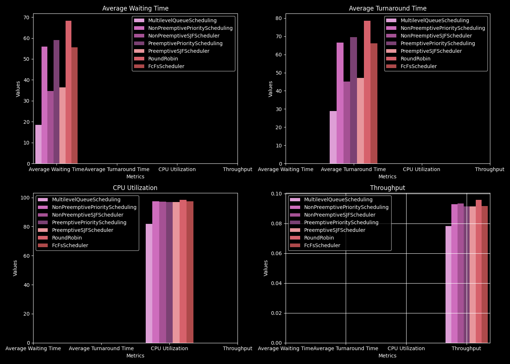

# Scheduling-Algorithms-for-CPU

# Table of content

## [🔗 First-Come, First-Served (FCFS)](assets/md/fcfs.md)

## [🔗 Shortest Job First (SJF)](assets/md/sjf.md)

## [🔗 Round Robin (RR)](assets/md/round_robin.md)

## [🔗 Priority Scheduling](assets/md/priority.md)

## [🔗 Multilevel Queue Scheduling](assets/md/multy_queue.md)

# In summary
### Here is banchmark of all algorithms

### [🐍 Python code](./src/banchmark_enerator.py)

